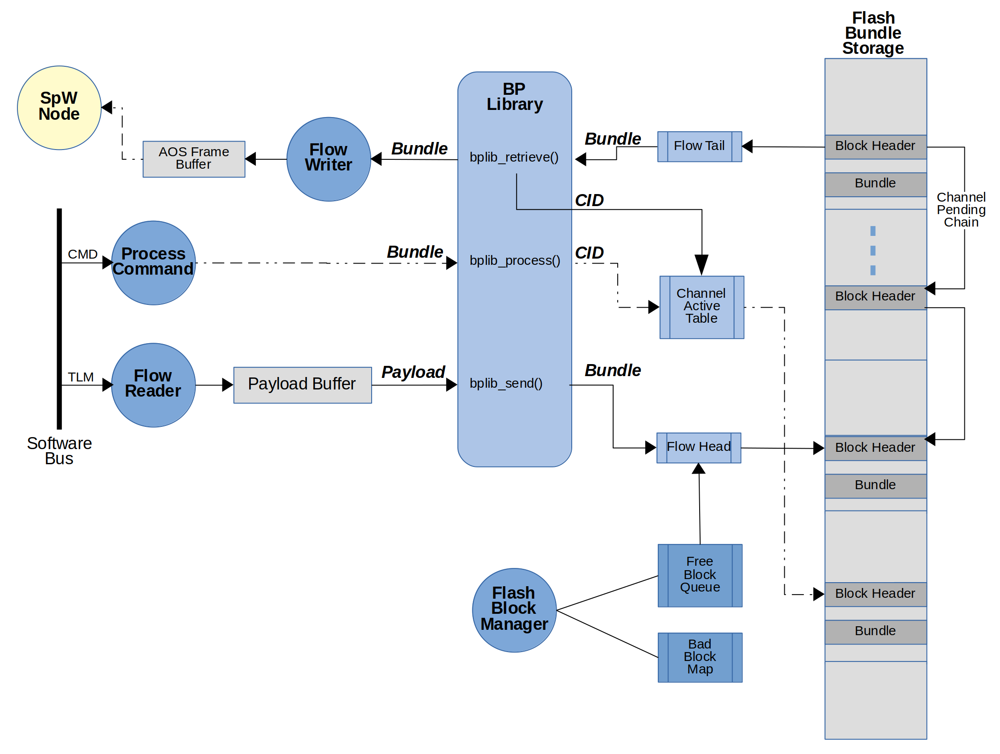

# bplib

Bundle Protocol Library
----------------------------------------------------------------------

The Bundle Protocol library uses the concept of a bundle channel to manage the different source streams of data it receives and bundles that it produces. A channel specifies how the bundles are created (e.g. primary header block fields) at the time the bundle is attempted to be transmitted. The library supports a thread-safe synchronous blocking I/O model where no call-backs are necessary and requested operations will either block according to the timeout or return an error code immediately if the operation cannot be performed.

## Application Programming Interface (API)

#### Initialize

`int bplib_init(char* convergence, char* node, boolean resume)`

Initializes the BP library for a convergence layer and if _resume_ is true then it attempts to recover any data from persistent storage that has not been sent.

_convergence_ - string identifying the convergence layer to be used

_node_ - endpoint node ID in the format of "{schema}:{node}" used to populate default values for source, reportto, and custodian node IDs. Note the {service} portion of the endpoint ID is not provided here but filled in at the time of bundle creation using the configured channel ID.

_resume_ - boolean specifying if the library is to resume previously started operations or start fresh

_returns_ - convergence ID.

#### Open Channel

`int bplib_open(int conv, char* dest)`

Opens a bundle channel using the convergence layer and destination information provided and returns a handle. 

Each convergence layer identified by the BP library will have its own dedicated resources for bundles.  When the library is initialized in a _resumed_ state, it assumes that all data queued for transmit was not sent and new convergence layers must be identified before data can be retrieved.

_conv_ - convergence ID returned by bplib_init

_dest_ - destination node ID in the format of "ipn:{node}.{service}"

_returns_ - channel ID. 

#### Close Channel

`void bplib_close(int channel)`

Closes the specified bundle channel and releases all run-time resources associated with it; this does not include the bundles stored in persistent memory.

_channel_ - which channel to close

#### Set/Get Options

`int bplib_setopt(int channel, int opt, void* val, int len)`
`int bplib_getopt(int channel, int opt, void* val, int len)`

_channel_ - which channel to apply option operation on

_opt_ - the option as described in the table below

| Option           | Bits | Units       | Description |
| ---------------- | ---- | ----------- | ----------- |
| BP_DESTINATION   | Var  | String      | Destination node ID expressed as "ipn:{node}.{service}" where node and service are unsigned 32-bit integers |
| BP_SOURCE        | Var  | String      | Source node ID expressed as "ipn:{node}.{service}" where node and service are unsigned 32-bit integers |
| BP_REPORTTO      | Var  | String      | Report to node ID expressed as "ipn:{node}.{service}" where node and service are unsigned 32-bit integers |
| BP_CUSTODIAN     | Var  | String      | Custodian node ID expressed as "ipn:{node}.{service}" where node and service are unsigned 32-bit integers |
| BP_CHBE          | 8    | Boolean     | Compressed Header Bundle Extension (RFC 6260) - 0: disable, 1: enable |
| BP_DACS          | 8    | Boolean     | DTN Aggregate Custody Signal (CCSDS 734.2-B-1 Annex D) - 0: disable, 1: enable |
| BP_INTEGRITY     | 16   | Mask        | Integrity Check; bits 0-7 specify header checksum, bits 8-15 specify payload checksum - 0: none, 1: 8CRC16, 2: XOR32, 3: 8SUM32 |
| BP_TIMEOUT       | 32   | Seconds     | Amount of time to wait for positive acknowledgment of bundle before retransmitting, 0: infinite |
| BP_CREATETIME    | 8    | Enumeration | Creation Time Population - 0: use system time at bundle creation, 1: use application supplied value |
| BP_COS           | 8    | Enumeration | Class of Service - 0: bulk, 1: normal, 2: expedited |
| BP_LIFETIME      | 32   | Seconds     | Amount of time added to creation time specifying duration of time bundle is considered valid, 0: infinite |
| BP_RETXPRIO      | 8    | Boolean     | Retransmit Priority - 0: retransmits occur when no other bundles are ready to be sent, 0: retransmits take precedence over next bundle to be sent |
| BP_MAXLENGTH     | 32   | Bits        | Maximum length of the bundle (including header and extension blocks); if length exceeded, then a fragmented bundle is created |
| BP_MAXFRAGMENT   | 32   | Bits        | Maximum length of a bundle fragment (including header and extension blocks); if fragment length not reached, then an unfragmented bundle is created |
| BP_SEQUENCING    | 32   | Seconds     | Number of seconds before creation time sequence number is reset, 0: infinite |

_val_ - the value set or returned

_len_ - the length in bytes of the memory pointed to by _val_

_returns_ - return code (see below).

#### Create Bundle

`int bplib_create(int channel, void* payload, int size, int timeout)`

Initiates sending the data pointed to by _payload_ inside a bundle by creating the bundle and filling it out using the _channel_ parameters.  Subsequent to the call the application must call the bplib_retrieve function to fetch the next bundle to be sent. Given class of service and retransmits, among other things, the next bundle fetched is not necessarily the one that was just created.

_channel_ - channel to create bundle on

_payload_ - pointer to data to be bundled; the entire payload will be bundled in one bundle

_size_ - size of payload in bytes

_timeout_ - 0: check, -1: pend, 1 and above: timeout in milliseconds

_returns_ - size of bundle created in bytes, or return code on error (see below).

#### Append Bundle

`int bplib_append(int channel, void* payload, int size, int timeout, int control)`

Appends the data pointed to by _payload_ to the current bundle.  This is used to create bundles that are too large to fit into processor memory (RAM).  The maximum bundle and fragment sizes are used to automatically create and fragment the bundle.  The _control_ flag is used to assert the end of a bundle.

_channel_ - channel to create bundle on

_payload_ - pointer to data to be bundled; the payload will be apended to the current bundled and fragmented automatically into smaller bundles based on the maximum bundle and fragment sizes.

_size_ - size of payload in bytes

_timeout_ - 0: check, -1: pend, 1 and above: timeout in milliseconds

_control_ - flag indicated whether or not the payload terminates the current bundle or not

_returns_ - size of bundle created in bytes, or return code on error (see below).

#### Retrieve Bundle

`int bplib_retrieve(int channel, bp_bundle_t* bundle, int timeout)`

Reads the next bundle from the BP library to be sent over a convergence layer. The convergence layer is required to successfully send the bundle. (Note: If it fails to do so, it can call bplib_process and pass in an administrative bundle that indicates that the bundle was not sent).

_channel_ - channel to retrieve bundle from

_bundle_ - pointer to the bundle being returned

_timeout_ - 0: check, -1: pend, 1 and above: timeout in milliseconds

_returns_ - size of bundle in bytes, or return code on error (see below)

#### Process Bundle

`int bplib_process(int channel, bp_bundle_t* bundle, int timeout)`

Processes the provided bundle. If bundle is an aggregate custody signal, then any acknowledged bundles will be freed from memory and any missing bundles will be inspected and the appropriate actions will be taken depending on the options set by the bundle's channel.

_channel_ - channel to process bundle on; note that the {service} number of the source endpoint ID of the DACS indicates the channel to use

_bundle_ - pointer to a properly formated bundle

_timeout_ - 0: check, -1: pend, 1 and above: timeout in milliseconds

_returns_ - the number of bytes of payload, or return code (see below)

If this call returns a value greater than 0, then the application can call the `bplib_accept` function to read in the payload.  Since bundles can be fragemented, it is possible that it takes multiple bundles being processed before a payload can be returned to the application.  Also note that administrative records may not contain any payload for the application.  Lastly, it is possible and even likely that this call returns a value greater than 0, indicating a payload is ready, and then a subsequent call to `bplib_accept` returns a different payload.  See `bplib_accept` for more details.

#### Accept Payload

`int bplib_accept(int channel, bp_bundle_payload_t* payload, int timeout)`

Returns the next available bundle payload (from bundles that have been received and processed via the `bplib_process` function) to the application by populating the structure pointed to by the _payload_ pointer. This includes setting another member pointer to a data buffer containing the payload, setting the size of the payload, and any flags.  The payloads are queued as they are built and returned to the application based on class of service and creation time ordering.

_channel_ - channel to accept payload from

_payload_ - pointer to structure containing the payload

_timeout_ - 0: check, -1: pend, 1 and above: timeout in milliseconds

_returns_ - size of bundle payload in bytes, or return code on error (see below).

## Return Codes

| Code             | Value | Description |
| ---------------- | ----- | ----------- |
| BP_SUCCESS       | > 0   | Operation successfully performed |
| BP_TIMEOUT       | 0     | A timeout occurred when a blocking operation was performed |
| BP_CIDINUSE      | -1    | Custody ID rolled over and the BP library wants to use a value that is assigned to an active bundle that has not yet been acknowledged |
| BP_UNDERFLOW     | -2    | A request for a bundle was made (via bplib retrieve) with the timeout set to check and no bundle was available to return |
| BP_OVERFLOW      | -3    | A request to write a bundle was made (via bplib send) and there was no room in storage to store the bundle |
| BP_PARTIAL       | -4    | A partial payload was received (via bplib process), this is not an error |
| BP_ADMIN         | -5    | A administrative bundle was received (via bplib process), this is not an error |
| BP_FORMATERR     | -6    | A bundle could not be processed or send due to a format parsing error |

# To do

- defines for all of the block offsets in the bplib_blk_* modules

- need to make thread safe... mutex in bplib_os_* module

- when forwarding bundles, how to handle the sequence, service numbers... etc.

