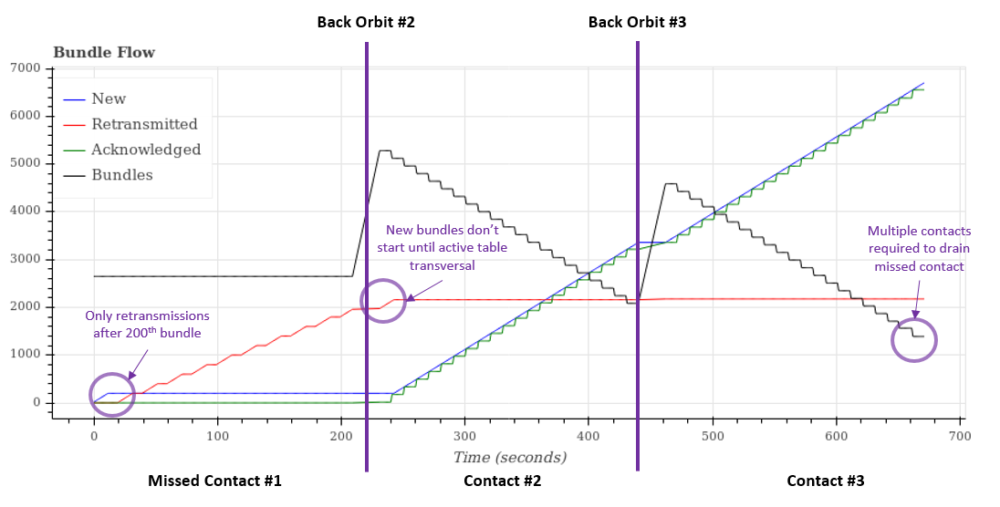
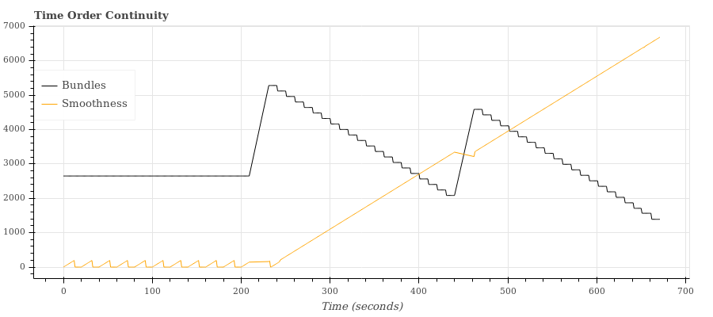
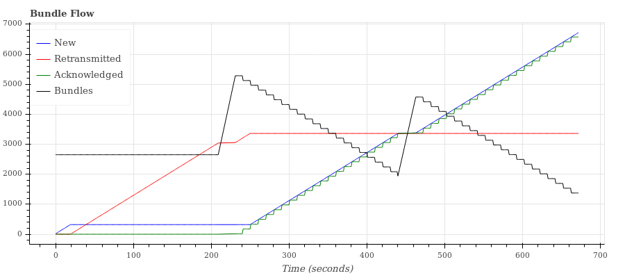

# Performance Analysis Under Intermittent Communication

[1. Description of Analysis](#1-description-of-analysis)  
[2. Case #1: Small Active Table](#2-case-1-small-active-table)  
[3. Case #2: Large Active Table](#3-case-2-large-active-table)  

### 1. Description of Analysis

The analysis presented in this application note describes the bundle flow from a sender to a receiver when communication occurs in intermittent bursts.

##### Scenario

The `binding/lua/pf_missed_contact.lua` script simulates a LEO spaceraft accumulating data continuously throughout an orbit and downlinking the data during ground station contacts.  Three orbits are simulated with the contact corresponding to the first orbit being missed and the second and third being made.

##### Parameters

* __Retransmit Order__: see discussion of `retransmit_order` provided in [README](../README.md)  
* __CID Reuse__: see discussion of `cid_reuse` provided in [README](../README.md)
* __Active Table Size__: maximum number of active bundles managed by the sender
* __Bundle Transmission Rate__: number of bundles sent per second during a contact
* __Timeout__: bundle protocol timeout setting of sender node
* __DACS Rate__: number of seconds before DACS bundle sent by receiver
* __Contact Time__: duration of contact when sender is able to successfully send bundles to receiver
* __Bundles per Orbit__: number of bundles generated each orbit

##### Metrics

* __New Bundles__: The total number of bundles that have been sent for the first time
* __Retransmitted Bundles__: The total number of bundles that have timed-out and been retransmitted
* __Acknowledged Bundles__: The total number of bundles that have been acknowledged via a DACS received by the sender
* __Bundles Stored__: The current number of bundles stored by the sender at any given time
* __Smoothness__: The oldest bundle sent during each second of the simulation (provides a measure of time order continuity)

### 2. Case #1: Small Active Table

##### Configuration

| Parameter | Value |
|:----------|:------|
| Retransmit Order | __RETX_OLDEST_BUNDLE__ |
| CID Reuse | __True__ |
| Active Table Size | __200 bundles__ |
| Bundle Transmission Rate | 16 bundles/second |
| Timeout | 20 seconds |
| DACS Rate | 10 seconds |
| Contact Time | 3.5 minutes |
| Bundles per Orbit | 2650 bundles |

##### Bundle Data Flow

> 
> Description:
>  - During the first contact from seconds 0 to 220, no bundles were received by the receiver and as a result, no bundles were acknowledged.  The "New" line (blue) shows early activity where new bundles were sent until the active table was full.  After that, the "Retransmitted" line (red) begins to grow as the bundles in the active table time out.  Since none of them are acknowledged, they keep timing out and no new bundles can be sent.   
>  - During the second contact from seconds 220 to 440, the additional bundles from the back-orbit are added and are seen to slowly drain.  Retransmissions cease as new bundles and acknowledged bundles grow in lock step. Towards the end of the contact the number of bundles stored drops below the starting value.
>  - At the start of the second contact no new bundles are sent at first because all the bundles in the active table have timed out and will be sent first.
>  - The third contact continues the process of started during the second contact.
> 
> Analysis:
>  - By the end of the third contact, there are still bundles being held over in the sender's storage.
>  - The active table size was small enough and the timeout large enough that all active bundles were retransmitted without additional timeouts.
> 

##### Time Order Continuity

> 
> Description:
>  - The order of the bundles being sent are roughly from oldest to newest
> 
> Analysis: 
>  - The small active table size nominally bounds out of order bundles to the depth of the table (this does not take into account periodically lost bundles)
>  - The timeout is sufficiently large that under nominal transmission rates, no bundles timeout
>  - At the start of each pass there are perturbations in the time order, but they are constrained to be no greater than the size of the active table.  After the active table clears, the bundles are in strict time order.
> 

### 3. Case #2: Large Active Table

##### Configuration

| Parameter | Value |
|:----------|:------|
| Retransmit Order | __RETX_SMALLEST_CID__ |
| CID Reuse | __False__ |
| Active Table Size | __4000 bundles__ |
| Bundle Transmission Rate | 16 bundles/second |
| Timeout | 20 seconds |
| DACS Rate | 10 seconds |
| Contact Time | 3.5 minutes |
| Bundles per Orbit | 2650 bundles |

##### Bundle Data Flow

> 
> Description:
>  - The behavior of the system is similar to case 1 with two exceptions: there are more retranmissions during the first contact, and there are slightly more new bundles during the first contact.
>
> Analysis:
>  - The larger active table size unexpectantly makes very little difference in the number of new bundles able to be received during the missed contact.  This is because by the time the sender has sent 320 bundles, at a rate of 16 bundles per second, the first bundle has timed-out.  The result is that the system is being bound by the timeout and bundle transmission rate instead of the active table size. 
>  - The only large effect the increased active table size had was that it allowed the bundles to be retransmitted at the full bundle transmission rate, since the active table was large enough to hold a full timeout's worth of bundles.
>  - In summary, with a large active table, there was significantly more data sent, but there was only a marginal increase in new data sent.
> 

##### Time Order Continuity

> 
> Description:
>  - Very similar behavior to case 1
> 
> Analysis: 
>  - Since the active table size was being shortcut by the timeout period, the time order continuity is largely unaffected.  As the timeout setting is increased, the time ordering will show larger jumps.
> 